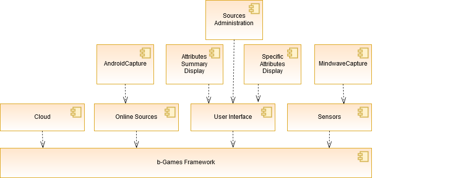

# Blended Games Framework

#### WEBSITE: [bgf.informatica.usach.cl](bgf.informatica.usach.cl)

### What is Blended Games Framework?
 

 

- BGF BGames is a software, aimed at observational researchers, that facilitates work with multimodal data in different stages of investigation.

# Blended Games Framework
